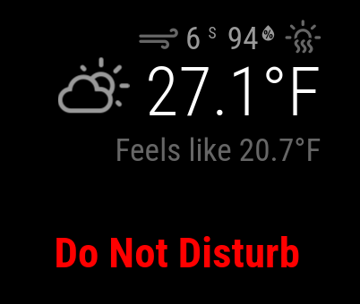

# MMM-DoNotDisturb

A MagicMirror² module that provides Do Not Disturb notification functionality for your smart mirror display.



This module allows you to display a Do Not Disturb message on your MagicMirror² display when an active calendar event is detected. Perfect for letting others know that you're busy and not to disturb you.

## Install

In your terminal, go to your MagicMirror² Module folder and clone MMM-DoNotDisturb:


cd ~/MagicMirror/modules
git clone https://github.com/trly/MMM-DoNotDisturb.git


## Update

```bash
cd ~/MagicMirror/modules/MMM-DoNotDisturb
git pull
```

## Using the module

To use this module, add it to the modules array in the `config/config.js` file:

```js
    {
        module: 'MMM-DoNotDisturb',
        position: 'top_bar',
        config: {
            // See configuration options below
        }
    },

```

## Configuration options

| Key | Type | Default | Description |
|---|---|---|---|
| `eventNotification` | `string` | `"CALENDAR_EVENTS"` | The notification name to listen for calendar events |
| `animationSpeed` | `number` | `1000` | Speed of the show/hide animation in milliseconds |
| `calendarSet` | `array` | `[]` | Array of calendar names to monitor. Empty array means all calendars. |
| `includeFullDayEvents` | `boolean` | `false` | Whether to include full day events in DND status |
## Developer commands

- `npm install` - Install devDependencies like ESLint.
- `npm run lint` - Run linting and formatter checks.
- `npm run lint:fix` - Fix linting and formatter issues.
